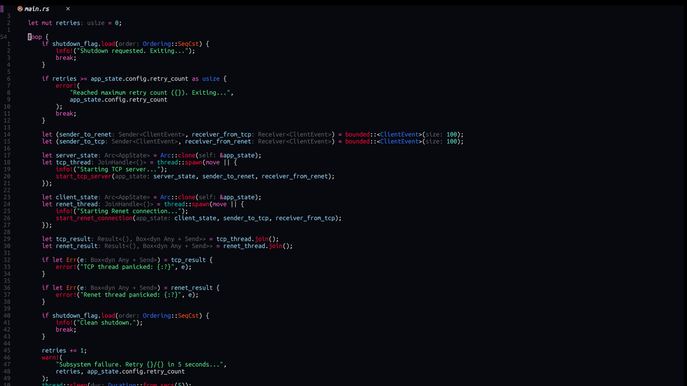

<div align="center">
  <h1>nagisa.nvim 🌠</h1>
   
</div>

A clean and minimalist Neovim theme with a dark background and vibrant red-orange highlights.

### 🚧 Warning 🚧

Please note that the plugin is currently under lazy development. Any help is greatly appreciated as the author has limited time to dedicate to it.

### ⁉️ Why?

Author likes dark and red/orange mixed themes

## 📦 Installation

Download with your favorite package manager

### packer.nvim

```lua
use("sanzharkuandyk/nagisa.nvim")
```

### lazy.nvim

```lua
{
  "azashiromerume/nagisa.nvim",
}
```

### Colorscheme

```vim
colorscheme EndOfTheWorld
```

```vim
vim.cmd.colorscheme("EndOfTheWorld")
```

### Compile

```vim
" 1. Modify your config
" 2. Restart nvim
" 3. Run this command:
:NagisaCompile
```

## Acknowledgements

- [Kanagawa](https://github.com/rebelot/kanagawa.nvim) - The project structure was inspired by this theme. Since nagisa theme is under lazy development, it is suggested to try out.
- The theme name was inspired by a character from the anime [Clannad](https://myanimelist.net/anime/2167/Clannad).
